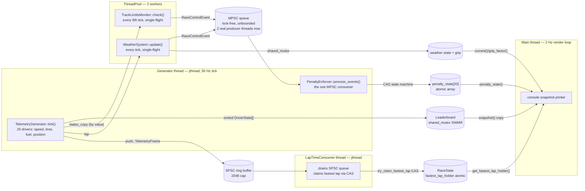

# RaceCondition-Z

A multithreaded F1 race telemetry simulator in C++23 — 20 drivers generating live physics-based telemetry at 50Hz across five real threads, with lock-free queues and CAS-based state machines doing the actual coordination, not `std::mutex` sprinkled everywhere.

It's a systems-programming exercise wearing a race simulator's clothes: the interesting code is the lock-free queues, the memory-ordering discipline, and the thread topology — not the driver stats.

## At a glance

**C++23** · CMake + FetchContent (GoogleTest, FTXUI) · custom lock-free SPSC/MPSC queues · `std::shared_mutex` SWMR pattern · `ThreadPool` (`packaged_task`/`future`) · `std::jthread`/`stop_token` · 54 GoogleTest cases (20 concurrency-focused, re-verified clean under **ThreadSanitizer** — including the live binary itself, where that check caught and fixed a real pre-existing race) · SPSC ring buffer sustains **45.4M ops/sec**.

## It builds, tests, and runs — for real


*Release build, the 6-suite/54-case CTest run, and a ThreadSanitizer run of the actual live binary (not just unit tests) — which caught a real pre-existing data race, fixed in this session (details below).*


*A live 50-lap, 20-driver race: a mid-race snapshot with a car in the pits and a live track-limits penalty, then the final classification and the fastest lap — claimed via a real cross-thread CAS race, not a single-threaded scan.*


*`benchmarks/benchmark.py` driving the Release/-O3 benchmark binary — real numbers from this machine, not vendored figures.*

## What this demonstrates

- **Lock-free concurrency, not just `std::mutex` everywhere.** The SPSC ring buffer ([spsc_queue.h](src/concurrency/spsc_queue.h)) and MPSC event queue ([mpsc_queue.h](src/concurrency/mpsc_queue.h)) are hand-written with explicit `acquire`/`release` memory ordering — no `seq_cst` used as a crutch. Every non-obvious ordering choice has a comment explaining *why* that ordering (not a stronger one) is sufficient.
- **Cache-conscious design.** The SPSC queue splits producer and consumer state onto separate `alignas(64)` cache lines, each caching the other side's index so the hot path touches zero foreign cache lines in steady state. The MPSC queue is a Vyukov-style intrusive linked list (unbounded, `exchange`-based enqueue) rather than a lock-protected `std::deque`.
- **A tool actually caught a real bug, and I fixed it rather than ignore it.** Rebuilding the live binary itself (not just the unit tests) under ThreadSanitizer surfaced a genuine pre-existing data race: `TelemetryGenerator::race_finished_` was a plain `bool`, written on the generator thread and read on the main thread with no synchronization — `main.cpp:147`'s exit condition. Fixed by making it (and the sibling `race_lap_` counter) `std::atomic`, with `acquire`/`release` on the flag that gates the loop exit and `relaxed` on the informational lap counter — mirroring the ordering discipline already used in [`race_state.h`](src/common/race_state.h). Re-ran the full live app under TSan afterward: 0 warnings.
- **CAS-based state machines, used where they're actually needed.** [`PenaltyEnforcer`](src/race_control/penalty_enforcer.cpp) uses `compare_exchange_strong` for the `NONE → PENDING` penalty transition specifically because two threads could race to issue the same penalty on the 3rd warning; a `fetch_add` alone isn't enough there, but *is* enough for the warning counter itself. [`LapTimeConsumer`](src/simulation/lap_time_consumer.cpp) uses `RaceState::try_claim_fastest_lap`'s CAS retry loop for exactly the same reason — multiple threads can observe a lap completion around the same time, and exactly one should win.
- **Correctness under real contention, not just single-threaded unit tests.** Every concurrent primitive has a dedicated multi-thread stress test (e.g. `MpscQueueTest.NoItemsLostConcurrent`, `LapTimeConsumerTest.ConcurrentConsumersExactlyOneWinner`), and both the concurrency suite *and* the live application binary pass cleanly under ThreadSanitizer — verified in this session, not asserted from memory.
- **A real test pyramid.** 1,577 lines of implementation code back onto 940 lines of GoogleTest across 6 suites (54 cases) — unit tests for pure logic, multi-thread stress tests for the queues and consumers, and a dedicated benchmark harness for throughput/latency claims.

## Architecture



Five real OS threads, each with genuine cross-thread data flow:

1. **Generator thread** — runs the physics tick at 50Hz, publishes to `Leaderboard` (read by the main thread), and drains the MPSC queue via `PenaltyEnforcer::process_events()`.
2. **Two `ThreadPool` workers** — run `TrackLimitsMonitor::check()` and `WeatherSystem::update()` off the generator thread, each pushing `RaceControlEvent`s into the *same* MPSC queue concurrently. This is the first time the app actually exercises the MPSC queue's multi-producer contract live, rather than only in `MpscQueueTest.MultiProducerStress`. Each job is guarded by a stored `std::future` so at most one call is ever in flight per job — both `TrackLimitsMonitor` and `WeatherSystem` carry unsynchronized RNG state, so two workers calling into the *same* instance concurrently would itself be a new race; single-flight submission avoids that without touching either class's internals. The states vector passed to `TrackLimitsMonitor::check()` is explicitly copied before submission — capturing the generator's live vector by reference would race with the very next tick's mutation of it.
3. **`LapTimeConsumer` thread** — the SPSC queue's actual consumer. Drains `TelemetryFrame`s and, on any frame marking a completed lap, races to claim it via `RaceState::try_claim_fastest_lap` — a CAS loop that was fully implemented and unit-tested but never called from anywhere in the app until this session.
4. **Main thread** — reads `Leaderboard`, `WeatherSystem`, and `PenaltyEnforcer` state every 500ms while all of the above keep running.

One thing still honestly unused: **FTXUI** is fetched and linked (`ftxui::screen/dom/component`) but not `#include`d anywhere — the console output is plain `std::cout`. It's vendored for a planned interactive dashboard that would be the natural consumer of `Leaderboard`'s existing `shared_mutex` reads, not currently wired up.

## Benchmarks

Measured with `python3 benchmarks/benchmark.py`, which builds `rcz_bench` in `-O3`/`NDEBUG` and runs it — the script is in the repo, so every number below is reproducible on your own machine (numbers will vary with core count and background load; see the note below the table).

Run in this session on an **Apple M1, 8 logical cores**:

| Component | Measurement | Result |
|---|---|---|
| SPSC ring buffer | 1 producer → 1 consumer, 10M `TelemetryFrame`s, count-based timing | **45.4M ops/sec** |
| MPSC event queue | 4 concurrent producers → 1 consumer, 2s window, `RaceControlEvent` | **15.4M ops/sec** aggregate |
| Thread pool dispatch | 8 workers, 200K `packaged_task` submissions, submit→start latency | p50 2.9µs / p95 10.5µs / p99 18.3µs / p99.9 36.2µs |
| Leaderboard SWMR reads | 7 readers + 1 writer (10ms write cadence), 20-driver snapshot copy, 2s window | **3.11M reads/sec** |
| End-to-end pipeline | SPSC push→pop latency, 100K timestamped samples | p50 69.9µs / p95 141.8µs / p99 145.1µs / p99.9 145.5µs |

Methodology notes, because these are easy to get wrong:
- SPSC/MPSC throughput is **count**-based (time from first push to last pop), not sampled — avoids `Clock::now()` overhead polluting the hot loop.
- Thread-pool latency is measured after a warm-up round so workers are already spun up; it reflects steady-state dispatch, not cold-start.
- These numbers moved noticeably between consecutive runs on this laptop (e.g. e2e p99 ranged 56–145µs across three runs in this session) — this is a shared dev machine, not an isolated benchmark box. Treat the table as "the right order of magnitude, measured for real," not a precise SLA.
- I did **not** re-verify the SPSC/MPSC throughput benchmarks under ThreadSanitizer (TSan changes timing too much to be meaningful there) — the TSan runs above cover *correctness* (the concurrency test suite, and now the live binary itself), which is the claim they're actually backing.

Two real bugs I hit and fixed while producing these numbers and the multithreading work above:
1. `benchmarks/benchmark.py` resolved its CMake source directory to `benchmarks/` itself, but `benchmarks/CMakeLists.txt` has no `project()`/`cmake_minimum_required()` — it's only valid when pulled in via `add_subdirectory()` from the repo root. Fixed by pointing the script's `-S` at the repo root instead.
2. The `race_finished_`/`race_lap_` data race described above, caught by running the live binary under ThreadSanitizer for the first time.

## Build & run

Requires CMake ≥ 3.20 and a C++23 compiler (tested with AppleClang 17 / Xcode 17). First configure fetches FTXUI and GoogleTest via `FetchContent`.

```bash
# Configure + build (Release)
cmake -B build -S . -DCMAKE_BUILD_TYPE=Release
cmake --build build --parallel

# Run the test suite (6 suites, 54 cases)
ctest --test-dir build --output-on-failure

# Run the live simulation
./build/src/RaceCondition-z

# Run the benchmark suite (builds a separate -O3 binary, ~30s)
python3 benchmarks/benchmark.py
```

To reproduce the ThreadSanitizer run shown above — including running the *live binary* itself, not just the test suites:

```bash
cmake -B build-tsan -S . -DCMAKE_CXX_FLAGS="-fsanitize=thread -g" -DCMAKE_EXE_LINKER_FLAGS="-fsanitize=thread"
cmake --build build-tsan --target test_concurrency test_simulation RaceCondition-z --parallel
./build-tsan/tests/test_concurrency
./build-tsan/tests/test_simulation
./build-tsan/src/RaceCondition-z
```

## What I'd do next

- Wire an FTXUI live dashboard as a second, real-time consumer of `Leaderboard`'s snapshots — the dependency is already vendored, just unused.
- `should_pit()` supports exactly one stop per driver; multi-stop strategy branching is the obvious next simulation feature.
- Add a fuzz/property test for the SPSC index math (`(tail + 1) & MASK` correctness under adversarial capacities) rather than relying solely on fixed-capacity unit tests.
- `TelemetryGenerator::standings()` returns a copy but isn't actually thread-safe (the source vector is mutated without synchronization) — it's unused today, but the misleading comment is now flagged in code; worth either locking it or removing it before anyone relies on it.
