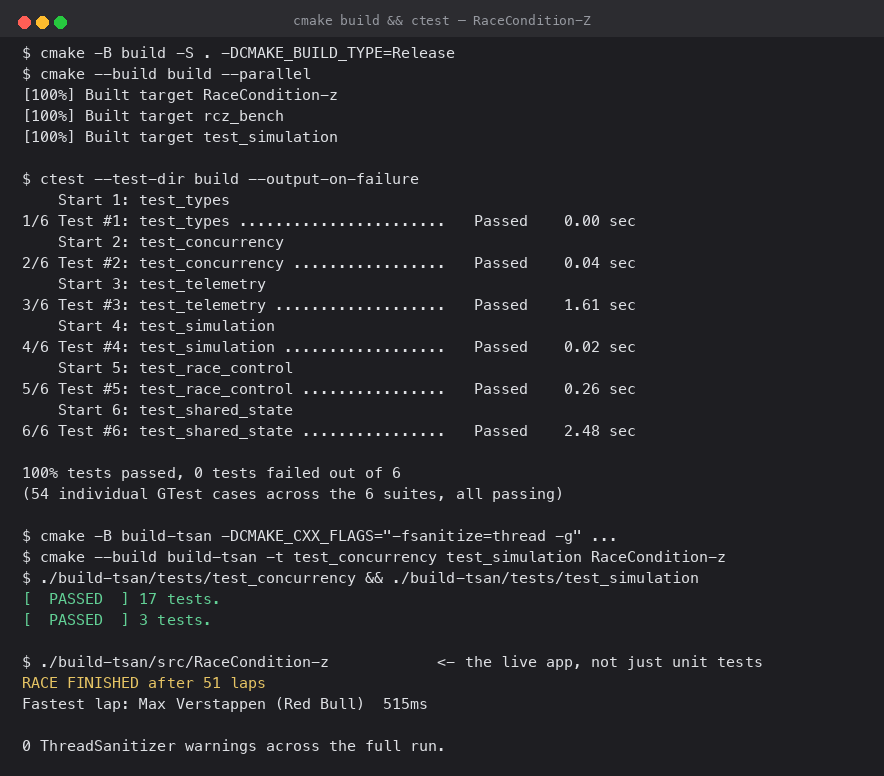
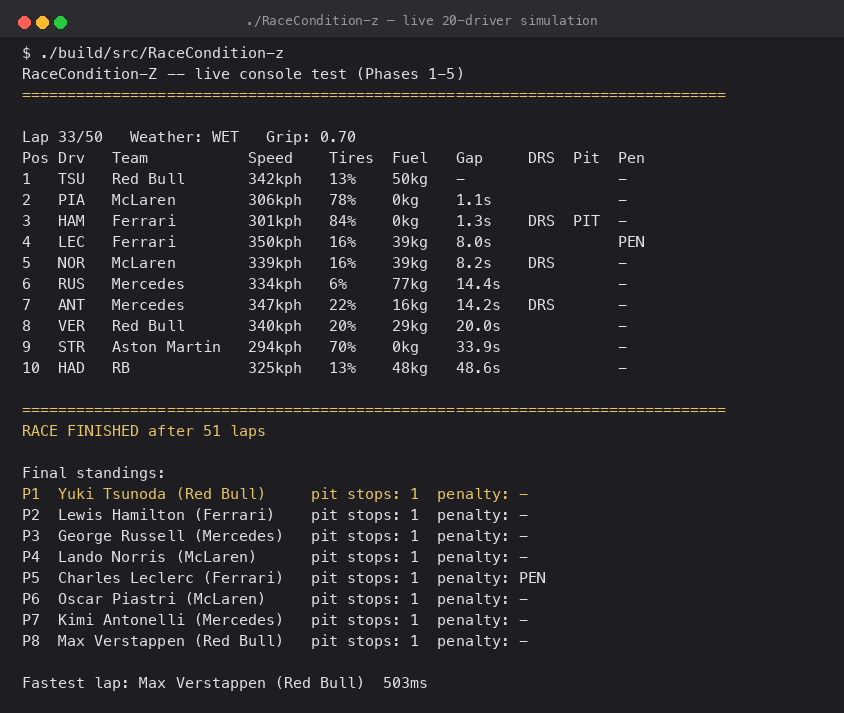
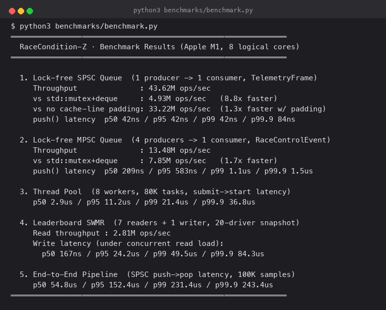

# RaceCondition-Z

A multithreaded F1 race telemetry simulator in C++23 — 20 drivers generating live physics-based telemetry at 50Hz across five real threads, with lock-free queues and CAS-based state machines doing the actual coordination, not `std::mutex` sprinkled everywhere.

It's a systems-programming exercise wearing a race simulator's clothes: the interesting code is the lock-free queues, the memory-ordering discipline, and the thread topology — not the driver stats.

## At a glance

**C++23** · CMake + FetchContent (GoogleTest, FTXUI) · custom lock-free SPSC/MPSC queues · `std::shared_mutex` SWMR pattern · `ThreadPool` (`packaged_task`/`future`) · `std::jthread`/`stop_token` · 54 GoogleTest cases (20 concurrency-focused, clean under **ThreadSanitizer** including the live binary itself, not just the test suites) · SPSC ring buffer is **8.8x faster than a `std::mutex`+`std::deque` baseline measured on the same workload** — not just a throughput number in isolation.

## In action



*Release build, the 6-suite/54-case CTest run, and a ThreadSanitizer run of the live binary itself — 0 warnings, not just the isolated test suites.*



*A live 50-lap, 20-driver race: a mid-race snapshot with a car in the pits and a live track-limits penalty, then the final classification and the fastest lap — claimed via a real cross-thread CAS race, not a single-threaded scan.*



*`benchmarks/benchmark.py` driving the Release/-O3 benchmark binary — real numbers from this machine, not vendored figures.*

## What this demonstrates

- **Lock-free concurrency, not just `std::mutex` everywhere.** The SPSC ring buffer ([spsc_queue.h](src/concurrency/spsc_queue.h)) and MPSC event queue ([mpsc_queue.h](src/concurrency/mpsc_queue.h)) are hand-written with explicit `acquire`/`release` memory ordering — no `seq_cst` used as a crutch. Every non-obvious ordering choice has a comment explaining *why* that ordering (not a stronger one) is sufficient.
- **Cache-conscious design, and the padding claim is measured, not asserted.** The SPSC queue splits producer and consumer state onto separate `alignas(64)` cache lines, each caching the other side's index so the hot path touches zero foreign cache lines in steady state. The benchmark suite includes an ablation — same queue, same workload, only the alignment changes — showing the padding is worth 1.3x, a real but modest effect, reported honestly rather than rounded up. The MPSC queue is a Vyukov-style intrusive linked list (unbounded, `exchange`-based enqueue) rather than a lock-protected `std::deque`.
- **Benchmarks that answer "does this actually help," not just "how fast is it."** Every lock-free structure is benchmarked against a `std::mutex`+`std::deque` baseline on the identical workload (SPSC: 8.8x faster; MPSC: only 1.7x faster). The gap between those two numbers is itself informative: MPSC's smaller advantage traces to a per-push heap allocation ([mpsc_queue.h:37](src/concurrency/mpsc_queue.h)) that costs the same whether or not there's a mutex — removing the lock alone doesn't remove the allocator cost. The `Leaderboard` benchmark also reports the writer's `update()` latency under concurrent read load (p50 167ns, p99 49.5µs), not just read throughput — the read number alone would have hidden that a `shared_mutex` writer can get stuck behind a burst of readers.
- **Every atomic field's memory order is a deliberate choice, not a default.** [`RaceState`](src/common/race_state.h) documents, per field, why `relaxed` is safe for the informational lap counter versus why `acquire`/`release` is required for the safety-car broadcast versus why a CAS retry loop is needed for the fastest-lap claim. `TelemetryGenerator`'s own `race_finished_`/`race_lap_` follow the same discipline: `acquire`/`release` on the flag that gates the main thread's loop exit, `relaxed` on the counter.
- **CAS-based state machines, used where they're actually needed.** [`PenaltyEnforcer`](src/race_control/penalty_enforcer.cpp) uses `compare_exchange_strong` for the `NONE → PENDING` penalty transition specifically because two threads could race to issue the same penalty on the 3rd warning; a `fetch_add` alone isn't enough there, but *is* enough for the warning counter itself. [`LapTimeConsumer`](src/simulation/lap_time_consumer.cpp) uses `RaceState::try_claim_fastest_lap`'s CAS retry loop for exactly the same reason — multiple threads can observe a lap completion around the same time, and exactly one should win.
- **Correctness under real contention, not just single-threaded unit tests.** Every concurrent primitive has a dedicated multi-thread stress test (e.g. `MpscQueueTest.NoItemsLostConcurrent`, `LapTimeConsumerTest.ConcurrentConsumersExactlyOneWinner`), and both the concurrency suite *and* the live application binary pass cleanly under ThreadSanitizer.
- **A real test pyramid.** 1,584 lines of implementation code back onto 940 lines of GoogleTest across 6 suites (54 cases) — unit tests for pure logic, multi-thread stress tests for the queues and consumers, and a dedicated benchmark harness for throughput/latency claims.

## Architecture

```
Generator thread (jthread, 50 Hz tick)
├─ TelemetryGenerator::tick()  [20 drivers: speed, tires, fuel, position]
│    ├─ sorted DriverState[] ──────────> Leaderboard (shared_mutex, write)
│    ├─ states_copy (by value) + lap ──> submit to ThreadPool: TrackLimitsMonitor::check()
│    ├─ lap ────────────────────────────> submit to ThreadPool: WeatherSystem::update()
│    └─ push TelemetryFrame ────────────> SPSC ring buffer (cap 2048)
└─ PenaltyEnforcer::process_events()   [the only thing that pops the MPSC queue]
     ├─ pop RaceControlEvent <───────── MPSC queue (lock-free, unbounded)
     ├─ on 3rd TRACK_LIMITS warning: CAS penalty_state[20] NONE -> PENDING
     └─ push PENALTY_ISSUED event ─────> MPSC queue (self — same thread, not concurrent)

ThreadPool — 2 workers pulling from one shared task queue (no fixed pinning;
either worker can run either job below), each job single-flight (at most 1
call in flight at a time)
├─ TrackLimitsMonitor::check()   [every 9th tick]
│    └─ push TRACK_LIMITS event ──────────> MPSC queue
└─ WeatherSystem::update()       [every tick, self-throttles every 5 laps]
     ├─ push WEATHER_CHANGE event ────────> MPSC queue
     └─ write weather state (shared_mutex)

LapTimeConsumer thread (jthread)
├─ pop TelemetryFrame <──────────── SPSC ring buffer
└─ on a completed lap: CAS RaceState::try_claim_fastest_lap ──> fastest_lap_holder (atomic)

Main thread
├─ every 500ms while the race is running:
│    ├─ read Leaderboard.snapshot()
│    ├─ read WeatherSystem.current() / grip_factor()
│    └─ read PenaltyEnforcer.penalty_state() per driver
└─ once, after that loop exits:
     ├─ read Leaderboard.snapshot() again (final standings)
     └─ read RaceState.get_fastest_lap_holder()   <- NOT part of the periodic loop
```

Five real OS threads, each with cross-thread data flow:

1. **Generator thread** — runs the physics tick at 50Hz, publishes to `Leaderboard` (read by the main thread), and drains the MPSC queue via `PenaltyEnforcer::process_events()` — which also pushes a `PENALTY_ISSUED` event back into that same queue when a driver's 3rd warning lands, to be picked up on the next call. That self-push happens synchronously on the consumer's own thread, not concurrently with anything.
2. **Two `ThreadPool` workers** — run `TrackLimitsMonitor::check()` and `WeatherSystem::update()` off the generator thread, each pushing `RaceControlEvent`s into the *same* MPSC queue concurrently — the one place in the app where the MPSC queue's multi-producer contract is genuinely exercised by separate concurrent threads, rather than only under `MpscQueueTest.MultiProducerStress`. Each job is guarded by a stored `std::future` so at most one call is ever in flight per job — both `TrackLimitsMonitor` and `WeatherSystem` carry unsynchronized RNG state, so two workers calling into the *same* instance concurrently would itself be a race; single-flight submission avoids that without touching either class's internals. The states vector passed to `TrackLimitsMonitor::check()` is explicitly copied before submission — capturing the generator's live vector by reference would race with the very next tick's mutation of it.
3. **`LapTimeConsumer` thread** — the SPSC queue's consumer. Drains `TelemetryFrame`s and, on any frame marking a completed lap, races to claim it via `RaceState::try_claim_fastest_lap` — a CAS retry loop also covered by `RaceStateTest.FastestLapCasExactlyOneWinner`.
4. **Main thread** — reads `Leaderboard`, `WeatherSystem`, and `PenaltyEnforcer` state every 500ms while the race is running. `RaceState`'s fastest-lap holder is read separately, once, after that loop exits — it's part of the final summary printout, not the periodic snapshot.

One thing still unused: **FTXUI** is fetched and linked (`ftxui::screen/dom/component`) but not `#include`d anywhere — the console output is plain `std::cout`. It's vendored for a planned interactive dashboard that would be the natural consumer of `Leaderboard`'s existing `shared_mutex` reads, not currently wired up.

## Benchmarks

Measured with `python3 benchmarks/benchmark.py`, which builds `rcz_bench` in `-O3`/`NDEBUG` and runs it — the script is in the repo, so every number below is reproducible on your own machine (numbers will vary with core count and background load; see the note below the table).

Every lock-free structure is benchmarked against a `std::mutex`+`std::deque` baseline measured on the same workload, and the SPSC queue additionally gets a cache-line-padding ablation (`alignas(64)` vs `alignas(8)` — 8 is the type's natural alignment floor, since `std::atomic<size_t>` can't be under-aligned below that) — so the padding claim in its doc comment is a measured number, not an assertion.

Measured on an **Apple M1, 8 logical cores**:

| Component | Measurement | Result |
|---|---|---|
| SPSC ring buffer | 1 producer → 1 consumer, 10M `TelemetryFrame`s, count-based timing | **43.6M ops/sec** |
| SPSC vs `std::mutex`+`std::deque` | same workload, 2s window | mutex: 4.9M ops/sec → lock-free is **8.8x faster** |
| SPSC vs no cache-line padding | same queue, `alignas(8)` instead of `alignas(64)` | unpadded: 33.2M ops/sec → padding is **1.3x faster** |
| SPSC `push()` call latency | 100K samples, isolated from consumer/round-trip | p50 42ns / p95 42ns / p99 42ns / p99.9 84ns |
| MPSC event queue | 4 concurrent producers → 1 consumer, 2s window, `RaceControlEvent` | **13.5M ops/sec** aggregate |
| MPSC vs `std::mutex`+`std::deque` | same workload, same producer count | mutex: 7.9M ops/sec → lock-free is **1.7x faster** |
| MPSC `push()` call latency | 4 producers, 20K samples each, 80K total | p50 209ns / p95 583ns / p99 1.1µs / p99.9 1.5µs |
| Thread pool dispatch | 8 workers × 10,000 rounds = 80K `packaged_task` submissions, submit→start latency | p50 2.9µs / p95 11.2µs / p99 21.4µs / p99.9 36.8µs |
| Leaderboard SWMR reads | 7 readers + 1 writer (10ms write cadence), 20-driver snapshot copy, 2s window | **2.81M reads/sec** |
| Leaderboard write latency | writer's `update()` cost under the same concurrent read load | p50 167ns / p95 24.2µs / p99 49.5µs / p99.9 84.3µs |
| End-to-end pipeline | SPSC push→pop round-trip latency, 100K timestamped samples | p50 54.8µs / p95 152.4µs / p99 231.4µs / p99.9 243.4µs |

Two findings worth calling out:

- **The MPSC queue's lock-free advantage (1.7x) is much smaller than the SPSC queue's (8.8x)** — because every `MpscQueue::push()` does a `new Node{...}` heap allocation regardless of whether it's lock-free or mutex-guarded ([mpsc_queue.h:37](src/concurrency/mpsc_queue.h)). Removing the mutex only removes the mutex's cost; it doesn't touch the allocator, which is the larger fraction of the per-push cost here. A pooled/freelist node allocator would be the next lever if MPSC throughput mattered more than it currently does in this app — see "what I'd do next."
- **The leaderboard's write latency has a long tail that the read-throughput number alone completely hides**: p50 is 167ns, but p99 is 49.5µs — nearly 300x worse. That's the actual cost side of the SWMR tradeoff: readers proceed in parallel, but the writer can get stuck behind a burst of them holding the shared lock. Read throughput alone would make `shared_mutex` look like a free lunch for the writer; it isn't.

Methodology notes:
- SPSC/MPSC *throughput* is **count**-based (time from first push to last pop) or a fixed time window, not per-op sampled — avoids `Clock::now()` overhead polluting the hot loop. The *push-latency* benchmarks use a deliberately different, slower methodology (timestamp every call) — that tradeoff is the point when what's needed is a distribution, not a rate.
- Thread-pool latency is measured after a warm-up round so workers are already spun up; it reflects steady-state dispatch, not cold-start.
- These numbers move noticeably between consecutive runs on this laptop (e2e p99 ranged 56–231µs across repeated runs) — this is a shared dev machine, not an isolated benchmark box, and Apple Silicon's P-core/E-core split means thread placement isn't fully controlled either. Treat the table as the right order of magnitude, not a precise SLA.
- The throughput/baseline benchmarks are not re-verified under ThreadSanitizer (TSan changes timing too much to be meaningful there) — the TSan runs described above cover *correctness* (the concurrency test suite and the live binary), which is the claim they're actually backing.

## Build & run

Requires CMake ≥ 3.20 and a C++23 compiler (tested with AppleClang 17 / Xcode 17). First configure fetches FTXUI and GoogleTest via `FetchContent`.

```bash
# Configure + build (Release)
cmake -B build -S . -DCMAKE_BUILD_TYPE=Release
cmake --build build --parallel

# Run the test suite (6 suites, 54 cases)
ctest --test-dir build --output-on-failure

# Run the live simulation
./build/src/RaceCondition-z

# Run the benchmark suite (builds a separate -O3 binary, ~30s)
python3 benchmarks/benchmark.py
```

To reproduce the ThreadSanitizer run shown above — including running the *live binary* itself, not just the test suites:

```bash
cmake -B build-tsan -S . -DCMAKE_CXX_FLAGS="-fsanitize=thread -g" -DCMAKE_EXE_LINKER_FLAGS="-fsanitize=thread"
cmake --build build-tsan --target test_concurrency test_simulation RaceCondition-z --parallel
./build-tsan/tests/test_concurrency
./build-tsan/tests/test_simulation
./build-tsan/src/RaceCondition-z
```

## What I'd do next

- Wire an FTXUI live dashboard as a second, real-time consumer of `Leaderboard`'s snapshots — the dependency is already vendored, just unused.
- `should_pit()` supports exactly one stop per driver; multi-stop strategy branching is the obvious next simulation feature.
- Add a fuzz/property test for the SPSC index math (`(tail + 1) & MASK` correctness under adversarial capacities) rather than relying solely on fixed-capacity unit tests.
- `TelemetryGenerator::standings()` returns a copy but isn't actually thread-safe (the source vector is mutated without synchronization); it's currently unused, but worth either locking it properly or removing it before anyone relies on it.
